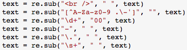
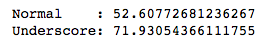
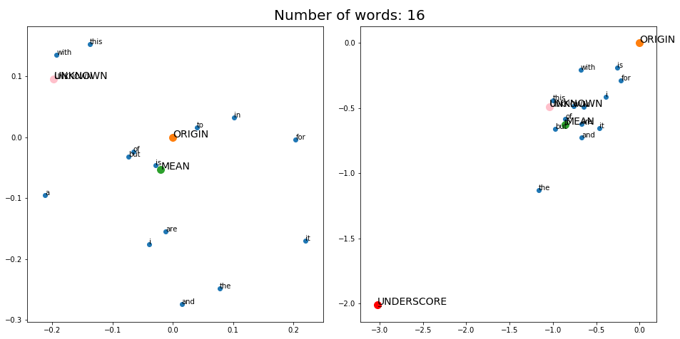
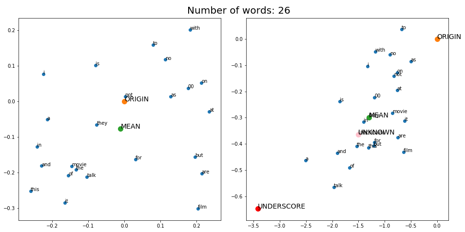
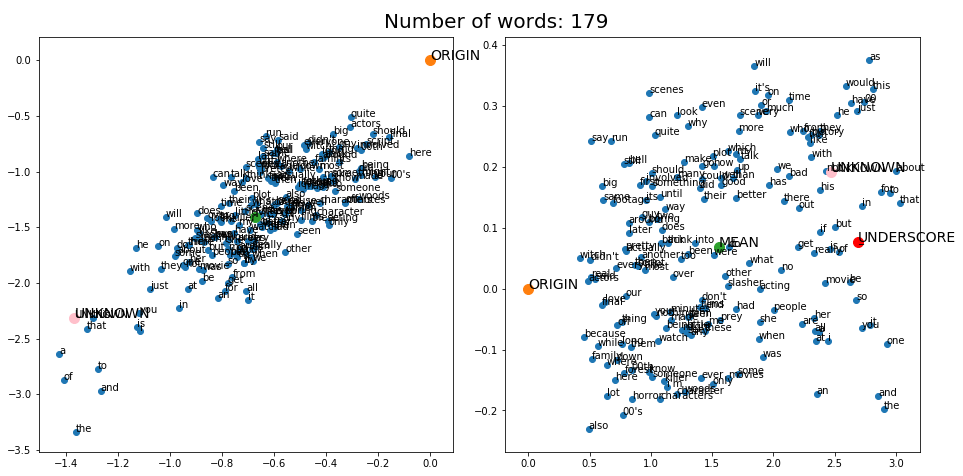
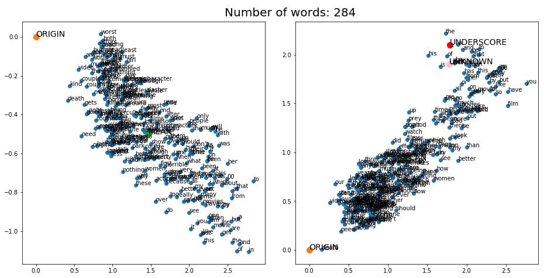
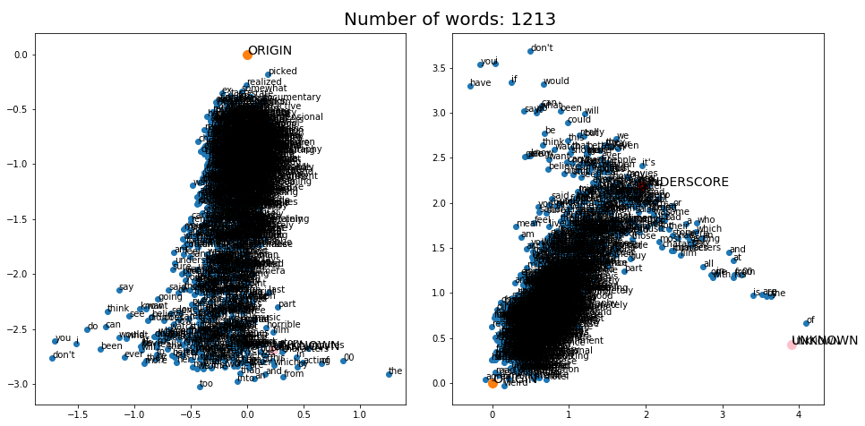
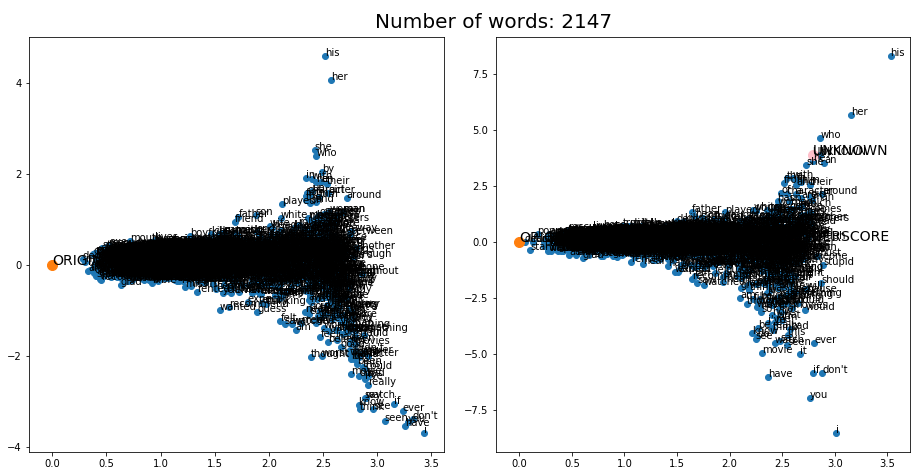
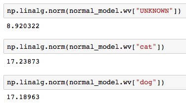
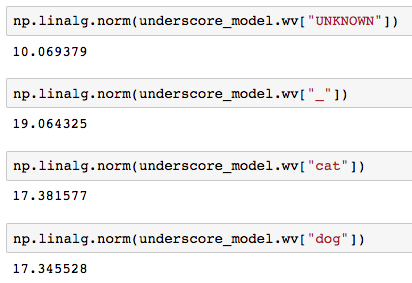

# Underscore word attack

> 고려대학교 강필성 교수님 비정형 데이타 분석 수업 발 프로젝트

> 송서하, 양우식, 정민성


## Data load (On linux shell)

```bash

$ . load-data.sh

$ file data/master.csv
data/master.csv: ISO-8859 text, with very long lines, with CRLF line terminators

```

## Logical order of file

1. Embedding.ipynb
2. Batch.ipynb
3. LSTM.ipynb


## About data

- 원본 데이터 10만개
     - 레이블 된것 5만개
        - 평가 데이터 25000개
        - 학습 데이터 25000개
     - 레이블 안된것 5만개

- 주요 데이터 속성
    - review: 영화에 대한 리뷰 문장
    - label: 긍정(pos),  부정(neg) 두 종류의 값
    

## Description - Embedding

### 데이터 전처리



### Word2Vec 하이퍼 파라미터

- min_count: 10
- window
    - normal: 5
    - underscore: 10
- dimension: 128

### 각 임배딩에 대한 시간복잡도



### 2차원에서 본 임배딩 결과 비교









## Description - Batch

### 배열 구축

 - 최대 문장 길이
     - Normal: 80
     - Underscore: 160
     
 - 데이터셋 Shape
     - X
         - Normal: (50000, 80, 128) 
         - Underscore: (50000, 160, 128)
     - y: (50000, 2)
 
 - 데이터셋 용량
     - X
         - Normal: 1.9GB
         - Underscore: 3.8GB
     - y: 169KB
     
### 임배딩 상태 확인 (by L2 norm)

- Normal case


- Underscore case

